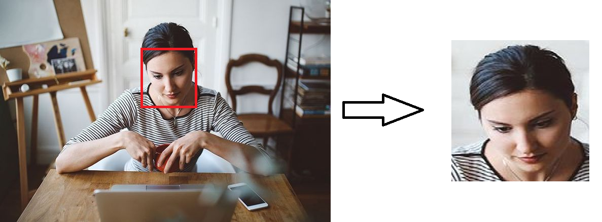

# Suivi Facial avec IA

## Description

Ce projet utilise l'intelligence artificielle pour suivre le visage d'une personne dans une vidéo en temps réel. L'image s'ajuste automatiquement pour maintenir le visage de la personne au centre du cadre.

## Démo
[](https://www.youtube.com/shorts/LpBKneENpIk)

## Fonctionnalités

- Suivi en temps réel du visage dans la vidéo.
- Ajustement automatique de l'image pour maintenir le visage au centre.

## Configuration Requise

- Source vidéo fonctionnelle.
- GPU compatible avec CUDA (pour des performances optimales).

## Algorithme

```python
TANT QUE la caméra est ouverte:
    # Lire une image depuis la caméra
    succès, img = lire_image_de_la_caméra()

    # Créer une copie de l'image pour le curseur
    curseur = copier_image(img)

    # Initialiser les variables
    SI cursorX == -1 ET cursorY == -1:
        cursorX, cursorY = moitié_largeur(img), moitié_hauteur(img)
    valX, valY = -1, -1

    # Faire une prédiction avec le modèle
    résultats = prédire_modèle(img, en_temps_réel=True, verbeux=False)

    # Traiter les résultats de la prédiction
    POUR chaque résultat DANS résultats:
        boîtes = résultat.boîtes

        POUR chaque boîte DANS boîtes:
            confidence = arrondir_au_supérieur((boîte.conf[0]*100))/100
            cls = entier(boîte.cls[0])

            # Vérifier la confiance et la classe
            SI confidence < seuil_confiance OU classNames[cls] != classNames[0]:
                CONTINUER

            # Coordonnées de la boîte englobante
            x1, y1, x2, y2 = boîte.xyxy[0]
            x1, y1, x2, y2 = entier(x1), entier(y1), entier(x2), entier(y2)

            # Calculer les coordonnées cibles et du centre
            targetX, targetY, centerX, centerY = moitié_entre(x1+x2), moitié_entre(y1+y2), moitié_largeur(img), moitié_hauteur(img)
            distance = racine_carree((targetX - centerX)**2 + (targetY - centerY)**2)

            # Mettre à jour la position du curseur si la cible est suffisamment éloignée
            SI distance > seuil_distance:
                valX = moitié_largeur(cursor)/zoomLevel
                valY = moitié_hauteur(cursor)/zoomLevel
                SI (targetY-valY >= 0 ET (targetY+valY) <= hauteur(cursor) ET (targetX-valX) >= 0 ET (targetX+valX) <= largeur(cursor)):
                    cursorX = targetX
                    cursorY = targetY

            # Dessiner des points sur l'image
            dessiner_point(img, (targetX, targetY), (255, 165, 0))
            dessiner_point(img, (centerX, centerY), (255, 165, 0))

            # Dessiner la boîte englobante sur l'image
            dessiner_boîte(img, (x1, y1), (x2, y2), (255, 165, 0), épaisseur=3)

            # Afficher les détails de l'objet
            dessiner_texte(img, classNames[cls] + ' ' + str((confidence*100)) + '%', (x1, y1-10), (255, 165, 0), 0.7, épaisseur=2)
            ARRÊTER

    # Imprimer les informations sur la position du curseur
    IMPRIMER('y1 => {}, y2 => {}, x1 => {}, x2 => {}, zoom => {}'.format(cursorY-valY, cursorY+valY, cursorX-valX,cursorX+valX, zoomLevel))

    # Recadrer la région du curseur à partir de l'image
    SI valX > 0 ET valY > 0:
        curseur = curseur[cursorY-valY:cursorY+valY, cursorX-valX:cursorX+valX]

    # Redimensionner le curseur
    largeur_cursor = entier(largeur(cursor)*pourcentage_échelle / 100*zoomLevel)
    hauteur_cursor = entier(hauteur(cursor)*pourcentage_échelle / 100*zoomLevel)
    dimensions_cursor = (largeur_cursor, hauteur_cursor)
    
    # Redimensionner le curseur
    curseur = redimensionner_image(curseur, dimensions_cursor, interpolation=cv2.INTER_AREA)
    AFFICHER_IMAGE('curseur', curseur)

    # Redimensionner l'image
    largeur_image = entier(largeur(img) * pourcentage_échelle / 100)
    hauteur_image = entier(hauteur(img) * pourcentage_échelle / 100)
    dimensions_image = (largeur_image, hauteur_image)
    
    # Redimensionner l'image
    img = redimensionner_image(img, dimensions_image, interpolation=cv2.INTER_AREA)
    AFFICHER_IMAGE('Image', img)

    # Arrêter la boucle si la touche 'q' est enfoncée
    SI touche_appuyée('q'):
        EXIT

    # Libérer l'objet de capture vidéo
    libérer_capture_video(cap)

    # Détruire toutes les fenêtres OpenCV
    détruire_toutes_fenêtres()
```


## Auteur
- Douraïd BEN HASSEN
